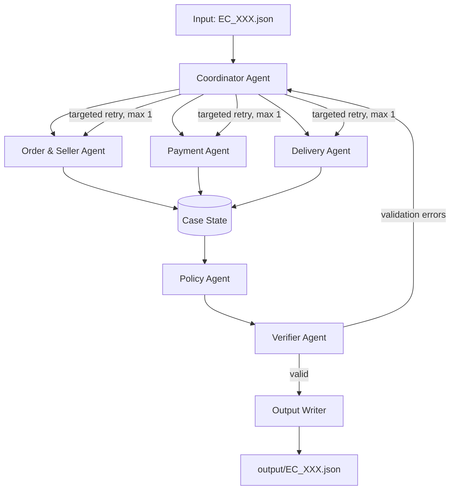

# Architecture - Multi-Agent E-commerce Dispute Resolution

## 1. Mục tiêu

Hệ thống xử lý từng case `EC_XXX` bằng cách đối chiếu `claimed_order_id` với dữ
liệu Olist, áp dụng `EC_POLICY_V1`, sau đó tạo một JSON kết quả có thể kiểm
chứng. Thiết kế ưu tiên tính xác định cho truy vấn dữ liệu, tính toán tiền và
đánh giá điều kiện chính sách; agent được dùng để phân chia trách nhiệm, handoff
và kiểm tra chéo thay vì suy đoán dữ liệu.

Pattern sử dụng là **Supervisor/Orchestrator + Specialist Workers + Verifier**
với shared state cho mỗi case.

## 2. Sơ đồ luồng



Ba specialist agent có thể chạy song song vì đều chỉ đọc dữ liệu của cùng một
order. `Policy Agent` chỉ chạy khi đã nhận đủ ba handoff. `Verifier Agent` không
tự sửa số liệu: nó trả lỗi có cấu trúc về Coordinator để gọi lại đúng agent cần
sửa. Mỗi nhánh chỉ được retry tối đa một lần để tránh vòng lặp vô hạn.

## 3. Shared case state và hợp đồng handoff

Mỗi case có một `CaseState` độc lập, không dùng dữ liệu hoặc kết luận của case
khác.

```text
CaseState
  input_case                 # nội dung từ input/EC_XXX.json
  order_seller_facts         # kết quả Order & Seller Agent
  payment_facts              # kết quả Payment Agent
  delivery_facts             # kết quả Delivery Agent
  policy_decision            # kết luận Policy Agent
  validation_errors[]        # lỗi từ Verifier Agent
  final_output               # JSON theo output schema
  trace_events[]             # sự kiện ghi vào trace.jsonl
```

Handoff là object có schema rõ ràng, không chuyển dữ liệu qua mô tả tự do:

| Từ agent | Đến agent | Nội dung tối thiểu |
| --- | --- | --- |
| Coordinator | Specialist | `case_id`, `claimed_order_id`, `policy_version`, phạm vi retry nếu có |
| Order & Seller | Policy | order status, item/seller IDs, item & freight totals, `shipping_limit_date`, evidence IDs |
| Payment | Policy | payment rows, payment IDs, payment total và evidence IDs |
| Delivery | Policy | carrier/delivered/estimated timestamps, kết quả giao trễ, evidence IDs |
| Policy | Verifier | proposed output và policy rule đã chọn |
| Verifier | Coordinator | danh sách lỗi theo field, agent cần chạy lại, lý do retry |

Mọi định danh trong state dùng ID gốc từ CSV. Các ID public trong output chỉ
được dựng theo format README: `order:`, `item:`, `payment:`, `seller:` và
`policy:`.

## 4. Vai trò agent

### Coordinator Agent

- Đọc và validate input tối thiểu (`case_id`, `claimed_order_id`,
  `policy_version`).
- Khởi tạo `CaseState`, dispatch ba specialist agent và chờ các handoff.
- Gọi Policy Agent, sau đó Verifier Agent.
- Điều phối retry có mục tiêu khi verifier báo lỗi; ghi output chỉ khi valid.
- Ghi các event lifecycle vào trace: `case_started`, `agent_dispatched`,
  `handoff_received`, `validation_result`, `case_completed`.

Coordinator không tính refund và không tự thay đổi kết quả policy.

### Order & Seller Agent

- Đọc `olist_orders_dataset.csv`, `olist_order_items_dataset.csv` và
  `olist_sellers_dataset.csv`.
- Xác nhận order tồn tại, lấy `order_status`, item IDs và seller IDs.
- Tính `item_total_brl` và `freight_total_brl` từ item rows, làm tròn 2 chữ số.
- Cung cấp `shipping_limit_date` theo item/seller để đánh giá seller handoff.
- Trả evidence `order`, `item`, `seller` có thể truy ngược về CSV.

### Payment Agent

- Chỉ đọc `olist_order_payments_dataset.csv` cho `claimed_order_id`.
- Tổng hợp `payment_value`, đếm payment rows và trả facts tài chính độc lập để
  có thể chạy song song với hai specialist agent còn lại.
- Trả payment IDs và evidence `payment` theo `payment_sequential`.
- Không tự kết luận refund; chỉ trả facts tài chính.

### Delivery Agent

- Đọc thông tin timestamp của order và deadline item từ shared state.
- So sánh nguyên trạng timestamp CSV, không tự đổi timezone.
- Xác định `delivered_after_estimate` và với mỗi seller liên quan,
  `carrier_received_after_shipping_limit`.
- Trả evidence `order`, `item` và `seller` cần thiết để Policy Agent xác định
  seller hoặc logistics chịu trách nhiệm.

### Policy Agent

- Đọc facts đã được ba specialist agent cung cấp.
- Tính reconciliation delta `abs(payment_total - (item_total + freight_total))`
  sau khi đã nhận cả payment và order/item facts.
- Áp dụng rule theo đúng thứ tự ưu tiên của `EC_POLICY_V1`:
  `canceled_order_paid` -> `unavailable_order_paid` ->
  `late_delivery_seller` -> `late_delivery_logistics` ->
  `valid_split_payment` -> `unsupported_late_claim`.
- Xác định `primary_issue`, root cause, responsible party, action, case status
  và recommended refund.
- Dựng output candidate, chỉ tham chiếu evidence do specialist agent cung cấp
  cộng thêm `policy:<root_cause_code>`.

Policy rule được cài bằng code/rule table versioned, không dựa vào diễn giải tự
do của model. Mỗi agent gọi provider được chọn để audit handoff tóm tắt, phát
hiện fact cần xem lại và ghi trace. Mặc định là `qwen/qwen3-8b` (8.2B) qua
OpenRouter; tùy chọn khác là `gpt-4o-mini` qua OpenAI Responses API. Kết luận
cuối vẫn phải đi qua rule engine, do đó model không thể làm thay đổi số tiền,
evidence ID hoặc policy outcome.

### Verifier Agent

- Kiểm tra toàn bộ ID trong output tồn tại, đúng format và không vượt giới hạn
  schema (entity IDs <= 5, evidence <= 10, causes/parties <= 3, actions <= 5).
- Kiểm tra số tiền làm tròn 2 chữ số, refund đúng với rule, `case_status` phù
  hợp và `confidence` thuộc `[0, 1]`.
- Kiểm tra evidence có đủ order/payment/item/seller/policy liên quan nhưng
  không bịa ID.
- Kiểm tra output đúng JSON schema trước khi `Output Writer` tạo file.

Verifier có quyền từ chối output nhưng không có quyền ghi đè facts hoặc kết quả
nghiệp vụ.

## 5. Phân quyền truy cập dữ liệu

| Thành phần | Quyền đọc | Quyền ghi |
| --- | --- | --- |
| Coordinator | `input/`, shared state, policy config | shared state, trace events |
| Order & Seller Agent | orders, order items, sellers CSV | phần `order_seller_facts` của state |
| Payment Agent | order payments CSV | phần `payment_facts` của state |
| Delivery Agent | orders và order items CSV | phần `delivery_facts` của state |
| Policy Agent | shared state, policy config | phần `policy_decision` của state |
| Verifier Agent | shared state, output schema | `validation_errors` của state |
| Output Writer | `final_output` đã valid | chỉ `output/EC_XXX.json` |

Không agent nào được đọc `.env` hoặc ghi trực tiếp output ngoại trừ Output
Writer. API key, nếu cần cho model provider, chỉ được runtime nạp từ `.env` và
không được đưa vào trace hay output.

## 6. Quyết định nghiệp vụ và độ tin cậy

`Policy Agent` chọn rule đầu tiên khớp theo thứ tự ưu tiên. Quyết định là một
mapping trực tiếp từ facts sang policy outcome, do đó confidence nên được gán
theo chất lượng dữ liệu chứ không phải mức độ đoán của model:

- `0.95`: đủ order, item/payment cần thiết và timestamp/rule kết luận rõ ràng.
- `0.85`: kết luận hợp lệ nhưng thiếu dữ liệu phụ không ảnh hưởng rule.
- Không ghi output khi thiếu dữ liệu bắt buộc hoặc verifier không thể xác thực.

Mọi monetary field sử dụng BRL và round half-up/round theo quy ước thống nhất
đến 2 chữ số thập phân trước khi so sánh hoặc ghi output. Payment reconciliation
cho phép sai số tối đa `0.10 BRL` như README.

## 7. Khả năng tái lập và audit

- CSV được load read-only và index theo `order_id` khi khởi động runtime để các
  case dùng cùng một nguồn facts.
- Mỗi lần chạy mới tạo lại `trace.jsonl`, không append trace cũ.
- Mỗi event trace cần có timestamp, `case_id`, agent, input/output handoff
  summary, evidence IDs và validation result; không log secret hoặc toàn bộ
  customer message khi không cần thiết.
- `metadata.json` khai báo provider/model đang chọn, parameter size khi provider
  công bố, framework, runtime và policy version. `qwen/qwen3-8b` là lựa chọn
  đáp ứng giới hạn 10B; OpenAI không công bố parameter size cho `gpt-4o-mini`,
  nên lựa chọn này phải được xác nhận với giảng viên trước khi nộp bài.
- Pipeline phải deterministically tạo lại cùng output từ cùng input, CSV và
  policy version.

## 8. Lý do chọn pattern

Pattern này đáp ứng yêu cầu có phân công, handoff và verification thực sự, đồng
thời tránh dùng swarm/debate cho bài toán có dữ liệu và rule xác định. Supervisor
giữ luồng xử lý rõ ràng; specialist worker giảm phạm vi mỗi agent; verifier tạo
một quality gate độc lập trước khi sinh 50 file nộp bài.
